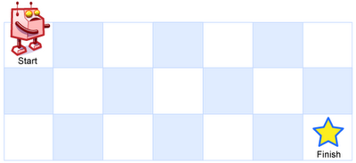

## Unique Paths

### Description
A robot is located at the top-left corner of a m x n grid (marked 'Start' in the diagram below).

The robot can only move either down or right at any point in time. The robot is trying to reach the bottom-right corner of the grid (marked 'Finish' in the diagram below).

How many possible unique paths are there?



_Above is a 3 x 7 grid. How many possible unique paths are there?_

__Note__: m and n will be at most 100.

### Code

```java

public class Solution {
    public int uniquePaths(int m, int n) {
        // Uses DP, and this time is the 2D dynamic programming problem.
        /*
         Creates a dpMatrix[m+1,n+1] to save the dp value. We update the matrix from 
         left to right and up to down. 
         For example:
         dpMatrix[2+1,3+1]: 
            0   0   0   0
            0   1   1   1
            0   1   2   3
        or dpMatrix[3+1, 4+1]:
            0   0   0   0   0
            0   1   1   1   1
            0   1   2   3   4
            0   1   3   6   10
         */
         
         int[][] dpMatrix = new int[m+1][n+1];
         // initial dpMatrix[1][1] = 1;
         dpMatrix[1][1] = 1;
         for (int i=1; i<=m; i++) {
             for (int j=1; j<=n; j++) {
                 if (i==1 && j==1) {
                     continue;
                 }
                 dpMatrix[i][j] = dpMatrix[i-1][j] + dpMatrix[i][j-1];
             }
         }
         
         return dpMatrix[m][n];
    }
}

```